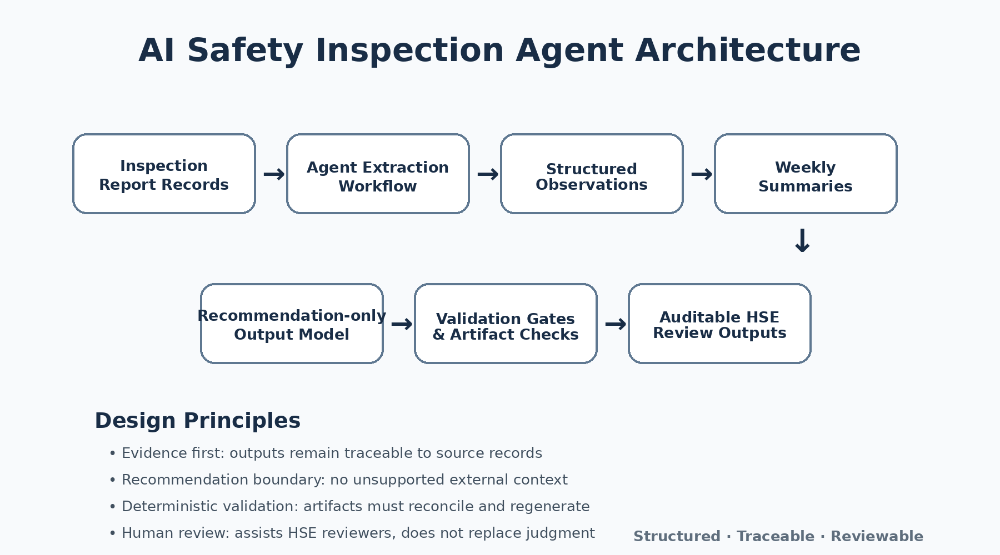

# AI Safety Inspection Evidence Review Agent

Kaggle AI Agents Capstone, Agents for Business track.

This repository contains a deterministic evidence pipeline and a thin agent demonstration layer for reviewing five synthetic Hong Kong Labour Department Form 3A-style construction safety reports. It converts one canonical fixture into daily observations, weekly summaries, a review workbook, bilingual PDFs, UI reference data, and an evidence-linked Safety Review Brief.

The project supports human review. It does not make legal findings, change recorded ratings, or replace a Safety Officer's judgment.

**[Open the public read-only review demo](https://ai-safety-inspection-agent.vercel.app)**

The static site also includes an [`/agent-demo`](https://ai-safety-inspection-agent.vercel.app/agent-demo) example trace. It is not an interactive chat and requires no service credentials.



## Problem

Construction safety report review is repetitive and evidence-heavy. A Safety Officer, Project Manager, or Auditor may need to compare several weeks of ratings, locate the source page for each issue, check whether recommendations exist, and confirm whether corrective evidence followed.

Loose summaries can hide the details that reviewers need. This project retains report, page, section, item, date, weekday, rating, recommendation, and PDF references so a reviewer can trace each result.

## Completed Work Package 1

Work Package 1 uses a synthetic five-week Form 3A dataset and an official bilingual field catalogue. The completed pipeline produces:

- 2,275 report × item × day observations;
- 325 weekly summaries;
- eight source-supported recommendations;
- three extraction-review cases kept separate from safety findings;
- a seven-sheet XLSX workbook with frozen headers;
- five individual four-page PDFs and one combined twenty-page PDF;
- a UI projection for report switching and page references, displayed by a static read-only review dashboard;
- five `Pending` Safety Review Brief findings;
- a manifest with paths, counts, purposes, and SHA-256 checksums.

The Safety Review Brief identifies a repeated scaffold issue, an R04 improvement followed by an R05 recurrence, one ladder rating-recommendation inconsistency, a Poor housekeeping observation without a recommendation, and missing scaffold follow-up evidence.

## Artifact map

| Artifact | Purpose |
| --- | --- |
| [`data/form3a/canonical-five-week-fixture.json`](data/form3a/canonical-five-week-fixture.json) | Sole factual source for the synthetic story |
| [`generated/work-package-1/normalized-data.json`](generated/work-package-1/normalized-data.json) | Daily observations, weekly summaries, and recommendations |
| [`generated/work-package-1/normalized-data.xlsx`](generated/work-package-1/normalized-data.xlsx) | Review workbook |
| [`generated/work-package-1/pdfs/`](generated/work-package-1/pdfs/) | Five individual PDFs and one combined PDF |
| [`generated/work-package-1/ui-projection.json`](generated/work-package-1/ui-projection.json) | Report and page reference data |
| [`generated/work-package-1/safety-review-brief.json`](generated/work-package-1/safety-review-brief.json) | Evidence-linked findings for professional review |
| [`generated/work-package-1/manifest.json`](generated/work-package-1/manifest.json) | Artifact inventory and checksums |

See the [Work Package 1 handoff](docs/work-package-1-handoff.md) for the full data rules, artifact inventory, and QA notes.

## Read-only demo

The Vite, React, and TypeScript dashboard reads the committed manifest, UI projection, Safety Review Brief, and PDFs directly. It supports report switching, native browser PDF preview, clickable findings, evidence details, individual and combined page references, and visible verification and boundary notes.

Run it locally:

```bash
corepack pnpm install --frozen-lockfile
corepack pnpm dev
```

Build the deployable static site with `corepack pnpm build:frontend`. Vercel uses the committed `vercel.json`; no backend or environment variables are required.

## ADK + MCP demonstration layer

The post–Work Package 1 demo layer keeps the approved artifacts read-only:

- MCP-style evidence tools expose manifest counts, Pending findings, finding evidence, report-page references, and checksum verification as structured JSON.
- A synthetic R03 Red Rainstorm Warning Signal context supplies reviewer prompts for post-rain scaffold inspection, drainage and water accumulation, excavation stability if excavation was active, temporary works, and material storage.
- A deterministic ADK-style local runner calls those tools and drafts a tentative Weather-context Review Brief for human review.

Run the terminal example without secrets or external services:

```bash
corepack pnpm adk:mcp:demo -- --report R03
```

This demonstration does not call the Hong Kong Observatory or another weather API. It does not infer that weather caused a finding, and it cannot change ratings, recommendations, finding status, PDFs, source records, or generated evidence artifacts. The human auditor remains in control.

## Reproduce and verify

Requirements:

- Node.js 24.14.1
- Corepack with pnpm 11.7.0

```bash
corepack pnpm install --frozen-lockfile
corepack pnpm generate:gate6
corepack pnpm test:gate6
corepack pnpm lint
corepack pnpm typecheck
corepack pnpm build
corepack pnpm test
```

`generate:gate6` regenerates the Work Package 1 artifacts in gate order, then writes the manifest. Final validation confirmed 97 automated tests across the Work Package 1 pipeline, MCP-style read-only evidence tools, ADK-style runner, CLI demo, and frontend regression checks. It also confirmed 11 valid artifact checksums, byte-identical clean regeneration, and visual QA across all 20 combined PDF pages.

## Review rules

- `N/A` and blank remain distinct.
- Weekly G/S/P dominance excludes `N/A` and blank. Ties use P > S > G.
- `extraction_status` stays separate from `safety_review_status`.
- Findings remain `Pending` until professional review.
- The pipeline does not change ratings.
- Extraction-review cases describe data-quality questions, not safety findings.

## Architecture boundaries

Work Package 1 does not implement OCR, ADK, MCP, weather context, safety-alert context, database, authentication, Kaggle submission, or external integrations. The PDFs come from approved synthetic structured data rather than scanned-document extraction. The later demonstration layer adds only a deterministic ADK-style runner, MCP-style read-only tools, and source-controlled synthetic weather-review context; it does not alter Work Package 1.

Packaging adds only a static read-only viewer and example agent trace for the approved artifacts. It has no backend, upload, editing, live weather integration, rating changes, production workflow, or production-readiness claim. OCR, official SDK-hosted agent services, live external context, and the other capabilities remain future work.

## Submission packaging

- [Kaggle writeup draft](docs/kaggle-submission-writeup.md)
- [Five-minute video storyboard and script](docs/kaggle-video-script.md)
- [Final submission checklist](docs/final-submission-checklist.md)

The repository does not contain a submitted Kaggle entry or a finished video.
